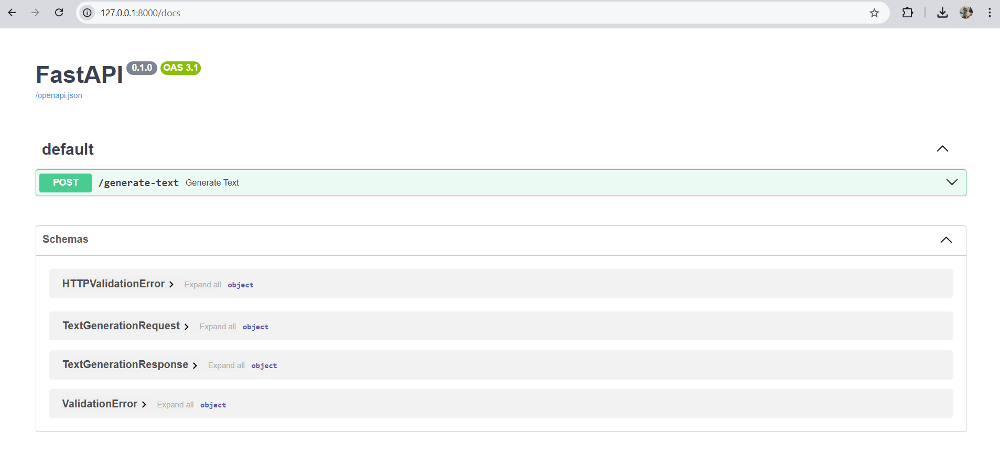

# Starting Your FastAPI Application

1. To start, make sure that your virtual environment is activated.

1. Start uvicorn using the following command:

```
uvicorn main:app --reload
```

1. Open a browser window and navigate to `http://127.0.0.1:8000/docs`

If you see this screen, you are good to go and you can start testing.

